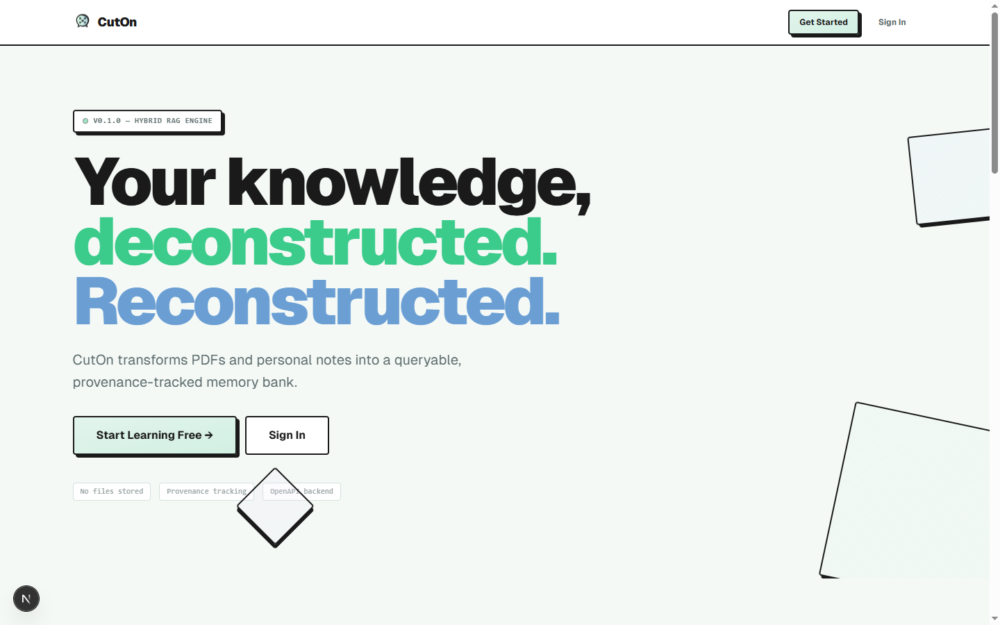
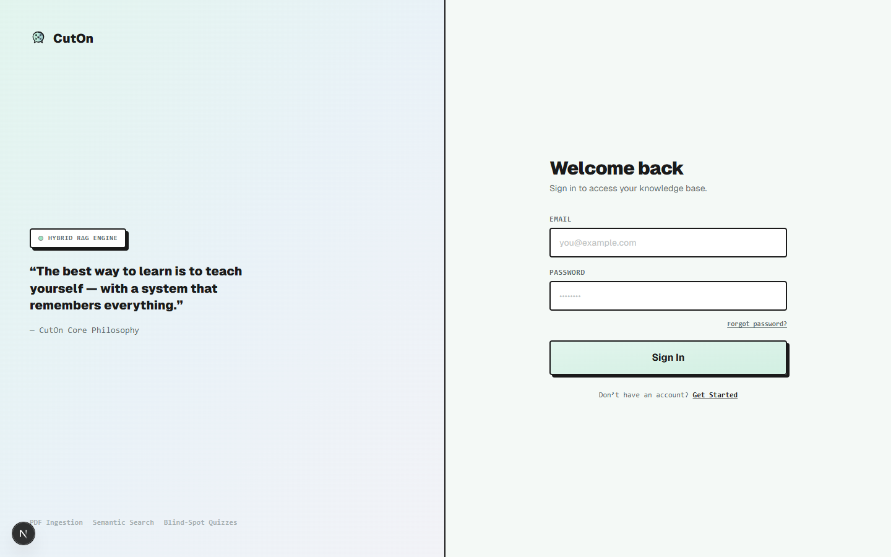

<div align="center">

<br />



<br /><br />

# CutOn

### Your knowledge, deconstructed. Reconstructed.

**Hybrid RAG learning system** — Upload PDFs, write journal entries, chat with an AI Study Buddy, and generate blind-spot quizzes. Everything stays yours.

<br />

<p>
  <a href="#-features"><strong>Features</strong></a> ·
  <a href="#-quick-start"><strong>Quick Start</strong></a> ·
  <a href="#-architecture"><strong>Architecture</strong></a> ·
  <a href="#-tech-stack"><strong>Tech Stack</strong></a> ·
  <a href="#screenshots"><strong>Screenshots</strong></a>
</p>

<br />

</div>

---

## ⚡ Overview

CutOn turns a folder of PDFs and scattered notes into a **living, queryable knowledge base**. Instead of just collecting files, you actually *learn* from them.

The engine uses a **hybrid RAG (Retrieval-Augmented Generation)** approach — queries run simultaneously against document chunks AND personal journal entries, then merge results by relevance with full provenance tracking.

> **No files stored.** Documents are parsed, chunked, embedded into a vector index, then discarded. Zero-storage pipeline. No cloud bills. No privacy risk.

---

## 🎯 Features

<div align="center">

| | |
|---|---|
|  |  |

</div>

### 🧠 Ephemeral Ingestion
Upload PDFs and TXT files. They're parsed, chunked, embedded into a vector index, then **discarded**. No lingering file bloat.

### 🔍 Hybrid Semantic Search
Every query runs simultaneously against your document chunks **AND** personal journal entries. Results are merged by relevance with provenance back to the source.

### 🤖 AI Study Buddy
A tutor that answers **exclusively from your own materials** — no hallucination, no generic fluff. Suggests journal entries and quizzes based on what you discuss.

### 🎯 Blind-Spot Quizzes
The engine compares what you've uploaded against what you've journaled. It generates targeted quizzes exposing **exactly what you haven't internalized yet**.

### 📓 Learning Journal
Personal notes, reflections, and debugging logs — your second brain. Each entry is embedded alongside source docs, making it searchable.

### 🔔 Smart Notifications
Get notified when document processing completes, embedding finishes, and more.

---

## 🏗️ Workflow

```
Upload → Chunk → Embed → Journal → Query → Quiz
```

| Step | What happens |
|------|-------------|
| **01** | Drop a PDF or TXT into your topic folder |
| **02** | Backend chunks & embeds in the background |
| **03** | Study the material at your own pace |
| **04** | Write journal entries about breakthroughs & bugs |
| **05** | Query your combined knowledge with AI |
| **06** | Generate blind-spot quizzes to lock it in |

---

## 🚀 Quick Start

### Prerequisites

- **Python 3.13+**
- **MongoDB** (local or Atlas)
- **Redis** (local or cloud, e.g. Upstash)
- **Google AI Studio API key** (for Gemini)

### Setup

```bash
# Clone and navigate
git clone https://github.com/your-org/cuton
cd cuton

# Frontend
npm install
npm run dev -w web
# → http://localhost:3000

# Backend (in a new terminal)
cd apps/backend
python -m venv .venv
source .venv/bin/activate  # Linux/Mac
# .venv\Scripts\activate   # Windows
pip install -r requirements.txt
cp .env.example .env       # Edit with your keys
uvicorn app.main:app --reload --port 8000
# → http://localhost:8000/docs
```

> **Minimum env vars:** `GEMINI_API_KEY`, `MONGO_URI`, `JWT_SECRET`

---

## 🧱 Architecture

```
┌─────────────────────────────────────────────┐
│               Next.js Frontend              │
│  Dashboard · Study Buddy · Quizzes · Journal│
└──────────────────┬──────────────────────────┘
                   │ REST + SSE
┌──────────────────▼──────────────────────────┐
│             FastAPI Backend                  │
│  Auth · Topics · Sources · Journal · Query   │
│  Study Buddy · Quizzes · Notifications · RAG │
└───────┬──────────────────┬──────────────────┘
        │                  │
┌───────▼──────┐   ┌──────▼───────┐
│   MongoDB    │   │    Redis     │
│  (Primary)   │   │   (Cache +   │
│              │   │    Celery)   │
└──────────────┘   └──────────────┘
        │
┌───────▼──────────────────────────────────────┐
│           Gemini AI (Google)                 │
│  Embeddings · Chat · Quiz Generation         │
└──────────────────────────────────────────────┘
```

### Backend Modules

| Module | What it does |
|--------|-------------|
| `auth` | JWT-based auth with forgot/reset password flow |
| `users` | User profiles & role management |
| `topics` | Learning topic organization |
| `documents` | File upload, parsing, chunking (PDF/TXT) |
| `journal` | Personal learning journal with embeddings |
| `query` | Hybrid RAG search (documents + journals) |
| `study_buddy` | AI chat with context-aware tutoring |
| `quizzes` | Blind-spot & topic review quiz generation |
| `rag_evaluation` | RAG response quality rating |
| `notifications` | In-app notifications |
| `dashboard` | Aggregated stats with Redis caching |
| `audit` | Admin audit logging |
| `embeddings` | Background vector embedding via Celery |

---

## 🛠️ Tech Stack

| Layer | Technology |
|-------|-----------|
| **Frontend** | Next.js 16, React 19, TypeScript, Tailwind CSS 4 |
| **Backend** | FastAPI (Python 3.13+), Pydantic v2 |
| **Database** | MongoDB (with Atlas Vector Search) |
| **Cache** | Redis (caching + Celery broker) |
| **AI** | Google Gemini (embedding + chat + generation) |
| **Background Jobs** | Celery (document chunking, embedding) |
| **Auth** | JWT (HS256) |
| **Email** | Brevo (transactional emails) |
| **Monitoring** | Sentry (error tracking) |
| **Deployment** | Docker (single image, multi-purpose) |

---

## Screenshots

<div align="center">

### Landing Page


### Login Page


</div>

---

## 📖 Learn More

- [Backend Operations Guide](apps/backend/README.md) — deployment, env vars, CLI commands
- [Database Indexes](apps/backend/docs/INDEXES.md) — Atlas Search vector index setup
- [Study Buddy](apps/backend/docs/STUDY_BUDDY.md) — AI tutor system prompt & behavior

---

<div align="center">

<br />

**Built with sweat, late-night coffee, and the unshakeable belief that learning should be systematic.**

<br />

<sub>CutOn © 2026 · [Report Bug](../../issues) · [Request Feature](../../issues)</sub>

</div>
